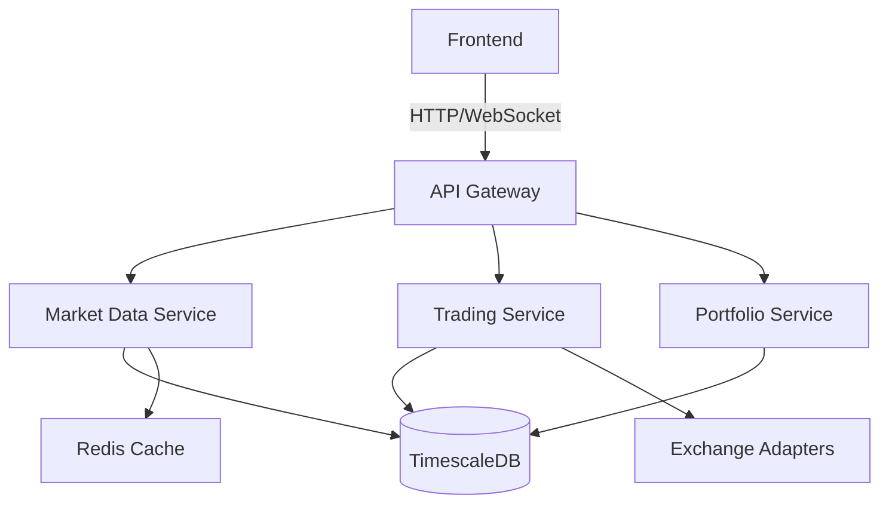

# High-Frequency Cryptocurrency Trading Platform

[](https://opensource.org/licenses/MIT)
[](https://www.python.org/downloads/)
[](https://nextjs.org/)

A high-performance, real-time cryptocurrency trading platform with ML-powered analytics.

## 🚀 Features

- Real-time market data processing (1M+ ticks/day)
- ML-powered trading signals (XGBoost, CatBoost)
- Interactive Next.js dashboard
- Containerized microservices
- Comprehensive monitoring (Prometheus/Grafana)

## 🏗 Architecture

## 🏗️ System Architecture

A high-level overview of the architecture behind the High-Frequency Cryptocurrency Trading Platform.


---

### 📌 Component Descriptions

- **Frontend (Next.js)**  
  - Server-side rendered React application  
  - Real-time updates using WebSocket  
  - Responsive UI with Tailwind CSS

- **API Gateway**  
  - Handles request routing and authentication  
  - Central entry point for all frontend-backend communication

- **Market Data Service**  
  - Streams and processes real-time crypto market data  
  - Publishes data via Redis pub/sub to downstream services

- **Trading Service**  
  - Manages order placement, execution, and order book logic  
  - Interfaces with Exchange Adapters for live trading

- **Portfolio Service**  
  - Tracks open/closed positions, account balance, and PnL  
  - Fetches historical trades and aggregates performance metrics

- **Exchange Adapters**  
  - REST & WebSocket interfaces to Binance, Coinbase, etc.  
  - Unified interface for order management and data ingestion

- **TimescaleDB**  
  - PostgreSQL extension for efficient time-series storage  
  - Stores price ticks, order history, portfolio snapshots

- **Redis**  
  - Caching layer for real-time market data  
  - Also used for pub/sub messaging between services

- **Object Storage (e.g., S3 or MinIO)**  
  - Stores model artifacts, strategy configs, and logs


## 🛠 Tech Stack

- **Frontend**: Next.js 13, TypeScript, Tailwind CSS, Shadcn UI
- **Backend**: Python, FastAPI, Rust (performance-critical components)
- **ML**: XGBoost, CatBoost, scikit-learn
- **Data**: TimescaleDB, Redis
- **Infra**: Docker, Kubernetes
- **Monitoring**: Prometheus, Grafana
- **CI/CD**: GitHub Actions

## 🚀 Quick Start

### Prerequisites

- Docker 20.10+
- Docker Compose 2.0+
- Python 3.9+
- Node.js 16+

### Local Development

```bash
# Clone the repository
git clone [https://github.com/yourusername/crypto-trading-platform.git](https://github.com/yourusername/crypto-trading-platform.git)
cd crypto-trading-platform

# Start services
docker-compose up -d

# Access the application
# Frontend: http://localhost:3000
# Backend API: http://localhost:8000
# API Docs: http://localhost:8000/docs
# Grafana: http://localhost:3001
# Prometheus: http://localhost:9090
