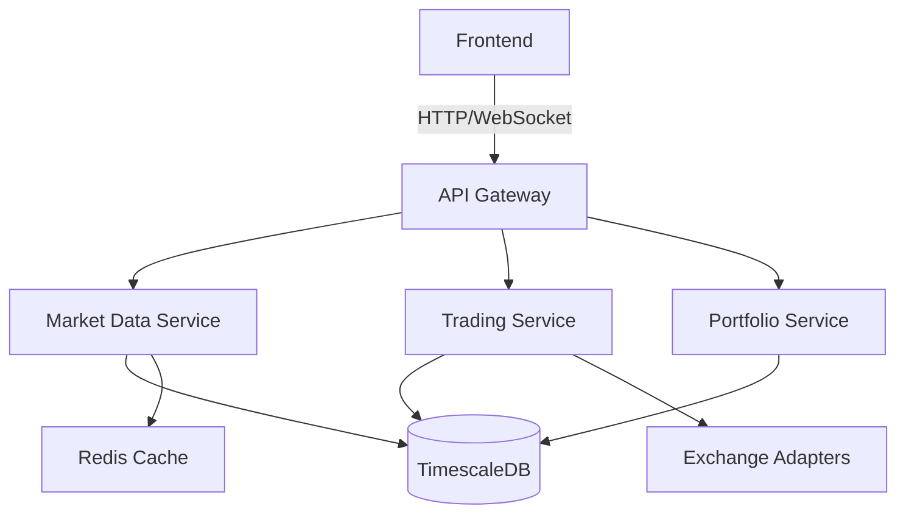

# High-Frequency Cryptocurrency Trading Platform

[](https://opensource.org/licenses/MIT)
[](https://www.python.org/downloads/)
[](https://nextjs.org/)

A high-performance, real-time cryptocurrency trading platform with ML-powered analytics.

## 🚀 Features

- Real-time market data processing (1M+ ticks/day)
- ML-powered trading signals (XGBoost, CatBoost)
- Interactive Next.js dashboard
- Containerized microservices
- Comprehensive monitoring (Prometheus/Grafana)

## 🏗 Architecture

## 🏗️ System Architecture

A high-level overview of the architecture behind the High-Frequency Cryptocurrency Trading Platform.


📌 Component Descriptions
Frontend: React-based UI that interacts with the backend over HTTP/WebSocket.

API Gateway: Central routing layer for all frontend-to-backend communication.

Market Data Service: Fetches live market feeds and caches them for internal use.

Trading Service: Executes buy/sell orders, runs strategies, and interacts with exchanges.

Portfolio Service: Manages account balances, PnL, open/closed positions.

TimescaleDB: Time-series database for storing historical trades, prices, and logs.

Redis Cache: Fast access layer for volatile market snapshots and streaming data.

Exchange Adapters: Interfaces to Binance, Coinbase, and other exchanges (REST/WebSocket).

## 🛠 Tech Stack

- **Frontend**: Next.js 13, TypeScript, Tailwind CSS, Shadcn UI
- **Backend**: Python, FastAPI, Rust (performance-critical components)
- **ML**: XGBoost, CatBoost, scikit-learn
- **Data**: TimescaleDB, Redis
- **Infra**: Docker, Kubernetes
- **Monitoring**: Prometheus, Grafana
- **CI/CD**: GitHub Actions

## 🚀 Quick Start

### Prerequisites

- Docker 20.10+
- Docker Compose 2.0+
- Python 3.9+
- Node.js 16+

### Local Development

```bash
# Clone the repository
git clone [https://github.com/yourusername/crypto-trading-platform.git](https://github.com/yourusername/crypto-trading-platform.git)
cd crypto-trading-platform

# Start services
docker-compose up -d

# Access the application
# Frontend: http://localhost:3000
# Backend API: http://localhost:8000
# API Docs: http://localhost:8000/docs
# Grafana: http://localhost:3001
# Prometheus: http://localhost:9090
